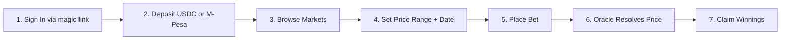
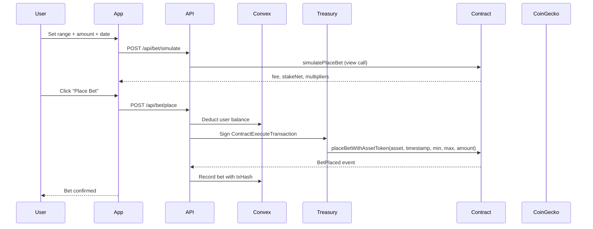
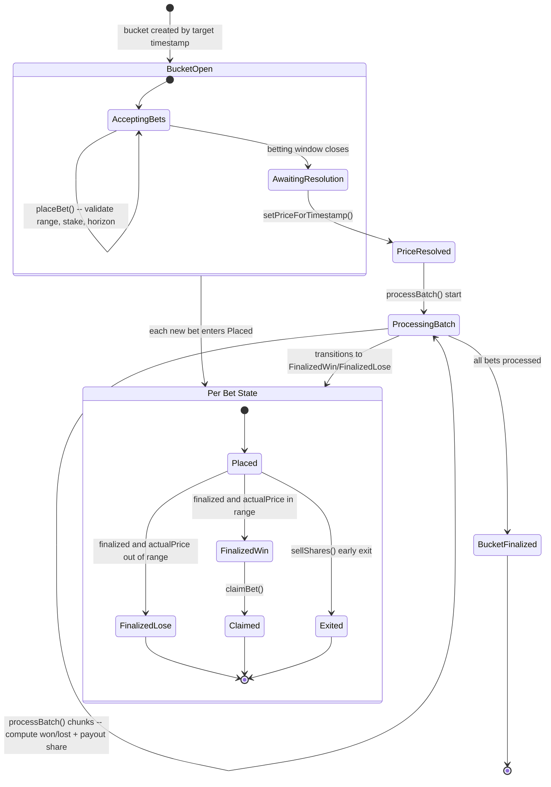

<div align="center">


# Predensity

###  Prediction Markets on Arc

[](https://predensity.com)
[](https://arc.io)
[](https://convex.dev)
[](LICENSE)

[Live App](https://predensity.com) | [Documentation](#overview)

</div>
---

## Overview

**Predensity** is a decentralized prediction market protocol for high-resolution crypto price forecasting, built on Arc (an EVM-compatible L1). Unlike conventional prediction markets focused on binary outcomes (e.g. Polymarket), Predensity lets users predict **price ranges across future timepoints**, creating a dynamic price-time probability surface.

The platform supports multiple market categories -- crypto, politics, sports, and technology -- with a weighted payout system that rewards **sharper predictions** and **earlier bets**. Users interact through a custodial balance system with deposits via EVM wallets (MetaMask, WalletConnect) or M-Pesa mobile money.

---


## Key Features

### Prediction Markets
- **Multi-category markets**: Crypto, Politics, Sports, Technology
- **Price range predictions**: Predict min-max price ranges, not just binary outcomes
- **Weighted payouts**: Sharper ranges and earlier bets earn higher multipliers
- **Dynamic Parimutuel Market (DPM)**: Early exit via share selling before resolution

### Wallet and Payments
- **4 wallet connectors**: HashPack, MetaMask, Blade, Kabila
- **M-Pesa integration**: Deposit and withdraw via mobile money (KES)
- **USDC staking**: ERC-20 token mode for stable-value betting
- **Platform balance system**: Custodial balance with Convex backend

### Data and Visualization
- **KDE probability charts**: Kernel density estimation of bet distributions
- **Real-time price feeds**: CoinGecko API for live crypto prices
- **Subgraph indexing**: Graph Protocol for on-chain event querying
- **Bet simulation**: Preview fees, multipliers, and estimated payouts before placing

### Admin and Resolution
- **magic link-authenticated admin panel**: Manage markets and resolve events
- **Batch processing**: Gas-efficient on-chain resolution in chunks of 50
- **Multi-asset price resolution**: Set prices for multiple assets and timestamps

---

## The Problem

| Problem | Predensity's Solution |
|---------|----------------------|
| Crypto traders lack continuous, high-resolution price forecasts | Builds a real-time price-time signal from crowd predictions |
| Existing markets (e.g. Polymarket) are binary or categorical | Enables continuous predictions on a full probability surface |
| Fragmented market signals and incentives | Aligns humans and AI agents via economic incentives |
| No prediction markets on Arc | First prediction market protocol deployed on Arc mainnet |

---

## How It Works

### Prediction Flow



1. **Sign In** -- magic link authentication creates a managed wallet on Convex
2. **Deposit** -- Transfer USDC from HashPack/MetaMask or deposit via M-Pesa
3. **Browse** -- Filter markets by category, status, and search
4. **Predict** -- Select a price range (min-max) and resolution date/time
5. **Bet** -- Platform deducts from balance, submits on-chain via treasury wallet
6. **Resolve** -- Admin sets actual price; contract processes bets in batches
7. **Claim** -- Winners receive proportional payout based on bet weight

### Bet Weighting System

Payouts are not equal -- they reward precision and conviction:

| Factor | How It Works | Multiplier Range |
|--------|-------------|-----------------|
| **Sharpness** | Narrower price range = higher weight | 0.1x (>40% width) to 2x (<2% width) |
| **Lead Time** | Earlier bets before resolution = higher weight | 0.1x (<1h) to 2x (>4 days) |
| **Bet Quality** | Combined sharpness x lead time | Determines payout share |

### Example: Alice, Bob, and Charlie Predict BTC Price

| User | Predicted Range | Sharpness | Result | Payout |
|------|----------------|-----------|--------|--------|
| Alice | $67,900 - $68,100 | Tight (2x) | Win | 18.66 USDC |
| Bob | $67,500 - $68,500 | Wide (0.3x) | Win | 11.19 USDC |
| Charlie | $70,000 - $72,000 | Off-target | Lose | 0 USDC |

---

## Architecture

### System Overview

```mermaid
graph TB
    subgraph Client["Client Layer"]
        UI[Next.js 14 + React 18]
        Charts[KDE Charts + D3]
        Wallets[MetaMask / WalletConnect]
    end

    subgraph Auth["Auth Layer"]
        magic link[magic link Authentication]
    end

    subgraph Backend["Backend Layer"]
        Convex[Convex Backend]
        API[Next.js API Routes]
    end

    subgraph Blockchain["Arc Network"]
        Contracts[Prediction Market Contracts]
        Treasury[Treasury Wallet]
    end

    subgraph Indexing["Data Layer"]
        GraphNode[Graph Node on VPS]
        Postgres[(PostgreSQL)]
        IPFS[IPFS]
    end

    subgraph Oracle["Price Feeds"]
        CoinGecko[CoinGecko API]
    end

    UI --> Wallets
    UI --> Charts
    UI --> magic link
    magic link --> Convex
    UI --> API
    API --> Convex
    API --> Contracts
    Wallets --> Treasury
    Treasury --> Contracts
    Contracts --> GraphNode
    GraphNode --> Postgres
    GraphNode --> IPFS
    Charts --> CoinGecko
```

### Data Flow -- Placing a Bet



---

## Smart Contract

### Contract Constants

```solidity
FEE_BPS              = 100       // 1% entry fee
EXIT_FEE_BPS         = 80        // 0.8% early exit fee
MIN_STAKE            = 0.01 USDC
MAX_STAKE            = 100 USDC
MAX_DAYS_AHEAD       = 30
MIN_DAYS_AHEAD       = 1
BATCH_SIZE           = 50        // Bets processed per batch
MAX_EXIT_RATIO_BPS   = 3000      // Max 30% of pool can exit early
MIN_K                = 10 USDC   // Minimum DPM liquidity parameter
```

### Contract Functions

#### User Functions

| Function | Description |
|----------|-------------|
| `placeBet(timestamp, priceMin, priceMax)` | Place a bet on the primary asset with native USDC |
| `placeBetWithAsset(asset, timestamp, min, max)` | Place a bet specifying the asset symbol |
| `placeBetWithToken(timestamp, min, max, amount)` | Place a bet using ERC-20 token (USDC) |
| `claimBet(betId)` | Claim winnings after resolution and aggregation |
| `sellShares(betId)` | Early exit via DPM -- sell shares before resolution |
| `getExitValue(betId)` | View current exit value for a bet |

#### Admin Functions

| Function | Description |
|----------|-------------|
| `setPriceForTimestamp(timestamp, price)` | Set resolved price for a single timestamp |
| `setPricesForTimestamps(timestamps[], prices[])` | Batch set prices for multiple timestamps |
| `setAssetPrices(assets[], timestamps[], prices[])` | Multi-asset batch price resolution |
| `processBatch(bucket)` | Process next batch of bets for a bucket |
| `withdrawFees()` | Withdraw collected protocol fees |

### Events

| Event | Emitted When |
|-------|-------------|
| `BetPlaced(betId, bettor, stake, priceMin, priceMax, targetTimestamp, asset)` | New bet placed |
| `BetFinalized(betId, actualPrice, won, payout)` | Bet resolved |
| `BetClaimed(betId, bettor, payout)` | Winnings claimed |
| `SharesSold(betId, bettor, exitPayout, exitFee)` | Early exit via DPM |
| `BatchProcessed(bucket, processedCount, winningWeight)` | Batch of bets processed |
| `AggregationCompleted(bucket, totalWinningWeight)` | All bets in bucket processed |

### Contract State Flow



---

## Technical Stack

| Layer | Technology |
|-------|------------|
| **Frontend** | Next.js 14, React 18, TypeScript |
| **Styling** | Tailwind CSS, Radix UI |
| **Charts** | D3.js, Recharts |
| **Blockchain** | viem v2, wagmi v2 |
| **Wallets** | MetaMask, WalletConnect |
| **Auth** | magic link |
| **Backend** | Convex, Next.js API Routes |
| **Smart Contracts** | Solidity 0.8.0, OpenZeppelin |
| **Indexing** | Graph Protocol (self-hosted Graph Node) |
| **Database** | Convex (backend), PostgreSQL (Graph Node) |
| **Price Feeds** | CoinGecko API |
| **Hosting** | Vercel (frontend), Hetzner VPS (subgraph) |

---

## Monorepo Structure

```
predensity/
├── frontend/                  # Next.js 14 frontend application
│   ├── src/
│   │   ├── app/               # Next.js app router pages
│   │   ├── components/        # React components
│   │   ├── hooks/             # Custom React hooks
│   │   └── lib/               # Utilities, types, contract config
│   ├── abi/                   # Contract ABIs (Crypto, Politics, Sports, Tech)
│   ├── convex/                # Convex backend functions
│   └── public/                # Static assets
├── smartContracts/            # EVM-compatible Solidity contracts
│   ├── contracts/             # Prediction market contracts
│   ├── scripts/               # Deployment and interaction scripts
│   └── foundry/               # Foundry framework setup
├── backend/
│   └── indexer/               # Graph Protocol subgraph indexer
│       ├── src/               # AssemblyScript mappings
│       ├── graph-node/        # Self-hosted Graph Node config
│       └── schema.graphql     # GraphQL schema
└── README.md
```

---

## Getting Started

### Prerequisites

- **Node.js** 18+ and npm
- **MetaMask Wallet** ([Download](https://metamask.io/))
- **magic link Account** ([magic link.com](https://magic link.com))
- **Convex Account** ([convex.dev](https://convex.dev))

### Installation

```bash
# Clone the repository
git clone https://github.com/i-mwangi/Predensisty.git
cd Predensisty

# Install frontend dependencies
cd frontend && npm install

# Install smart contract dependencies
cd ../smartContracts && npm install

# Install indexer dependencies
cd ../backend/indexer && npm install
```

### Environment Configuration

**`frontend/.env.local`**
```env
NEXT_PUBLIC_NETWORK=mainnet
NEXT_PUBLIC_ARC_CHAIN_ID=5042002
NEXT_PUBLIC_WALLET_CONNECT_PROJECT_ID=your_project_id
NEXT_PUBLIC_CONVEX_URL=your_convex_url
NEXT_PUBLIC_magic link_PUBLISHABLE_KEY=your_magic link_key
magic link_SECRET_KEY=your_magic link_secret
NEXT_PUBLIC_TREASURY_EVM_ADDRESS=0x...
NEXT_PUBLIC_SUBGRAPH_URL=your_subgraph_url
```

**`smartContracts/.env.local`**
```env
ARC_RPC_URL=https://rpc-arc-mainnet.arcplatform.io
PRIVATE_KEY=your_deployer_private_key
```

### Run Development

```bash
# Terminal 1 -- Frontend
cd frontend && npm run dev

# Terminal 2 -- Convex backend
cd frontend && npx convex dev
```

---

## Competitive Advantage

| Feature | Predensity | Polymarket | Augur | Azuro |
|---------|------------|------------|-------|-------|
| **Chain** | Arc | Polygon | Ethereum | Gnosis |
| **Prediction Type** | Price ranges | Binary | Binary | Binary |
| **Multi-category** | Yes | Yes | Yes | Sports only |
| **Weighted payouts** | Yes | No | No | No |
| **Early exit (DPM)** | Yes | Yes | No | No |
| **M-Pesa deposits** | Yes | No | No | No |
| **KDE visualization** | Yes | No | No | No |

### Key Differentiators

- **Price range predictions** -- not just yes/no, but continuous price surfaces
- **Weighted payout system** -- rewards precision and early conviction
- **M-Pesa integration** -- onramp for East African users via mobile money
- **Multi-category markets** -- crypto, politics, sports, technology in one platform
- **DPM early exit** -- sell shares before resolution with linear surplus pricing

---

## Roadmap

### Phase 1: Core (Current)
- [x] Crypto prediction markets with weighted payouts
- [x] Multi-category support (Politics, Sports, Technology)
- [x] M-Pesa deposit and withdrawal
- [x] Subgraph indexing for on-chain events
- [x] KDE probability visualization

### Phase 2: Expansion
- [ ] AI agent integration for automated predictions
- [ ] Leaderboard and social features
- [ ] Additional crypto assets and market types
- [ ] Mobile-responsive UI improvements

### Phase 3: Protocol Maturity
- [ ] Decentralized oracle integration (Pyth/Chainlink)
- [ ] Governance token
- [ ] Cross-chain support
- [ ] Security audit


## License

This project is licensed under the MIT License -- see the [LICENSE](LICENSE) file for details.

---

<div align="center">

### Predensity: Predict Price Ranges. Earn Weighted Payouts. Built on Arc.

**The first high-resolution prediction market protocol on Arc.**

</div>
