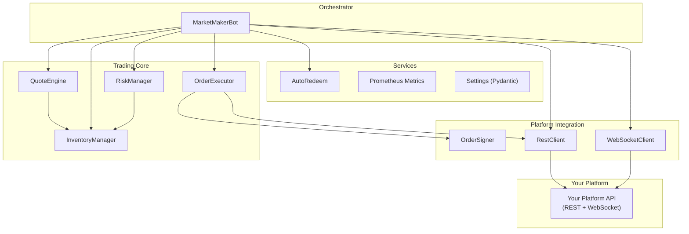
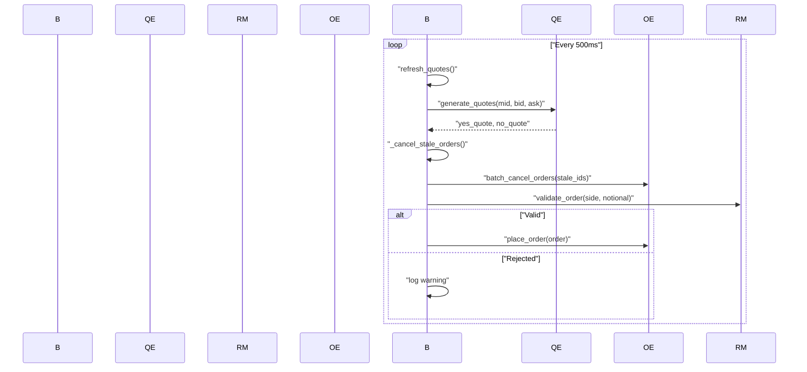

Here is the complete breakdown of every file, component, and code snippet in this market maker bot. I've gone through the entire codebase. Here's everything you need to replicate this in your own prediction market platform.

---

## Architecture Overview



---

## Complete File-by-File Breakdown

### 1. Project Structure

```
src/
├── __init__.py
├── config.py                          # All settings (Pydantic)
├── logging_config.py                  # Structured JSON logging
├── main.py                            # Orchestrator + entry point
├── market_maker/
│   ├── __init__.py
│   └── quote_engine.py                # Quote generation logic
├── inventory/
│   ├── __init__.py
│   └── inventory_manager.py           # Position tracking + balance control
├── risk/
│   ├── __init__.py
│   └── risk_manager.py                # Pre-trade validation
├── execution/
│   ├── __init__.py
│   └── order_executor.py              # Order placement + cancellation
├── polymarket/
│   ├── __init__.py
│   ├── rest_client.py                 # REST API client
│   ├── websocket_client.py            # WebSocket client
│   └── order_signer.py                # Cryptographic order signing
├── services/
│   ├── __init__.py
│   ├── auto_redeem.py                 # Auto-redeem settled positions
│   └── metrics.py                     # Prometheus metrics
└── utils/
    └── __init__.py
```

### 2. Dependencies (`pyproject.toml`)

```toml
requires-python = ">=3.11"
dependencies = [
    "websockets>=12.0",
    "httpx>=0.27.0",
    "web3>=6.15.0",
    "eth-account>=0.10.0",
    "pydantic>=2.8.2",
    "pydantic-settings>=2.1.0",
    "python-dotenv>=1.0.1",
    "structlog>=24.1.0",
    "prometheus-client>=0.20.0",
    "aiohttp>=3.9.0",
]
``` [1](#0-0) 

---

## 3. Configuration System (`src/config.py`)

This is the single source of truth for all bot parameters. Uses Pydantic `BaseSettings` to validate env vars from a `.env` file. **You must adapt every field here to match your platform's concepts.**

```python
from pydantic import BaseModel, Field
from pydantic_settings import BaseSettings, SettingsConfigDict

class Settings(BaseSettings):
    model_config = SettingsConfigDict(env_file=".env", env_file_encoding="utf-8", extra="ignore")

    environment: str = "development"
    log_level: str = "INFO"

    # Platform API (REPLACE with your platform's URLs)
    polymarket_api_url: str = Field(default="https://clob.polymarket.com")
    polymarket_ws_url: str = Field(default="wss://clob-ws.polymarket.com")

    # Authentication
    private_key: str = Field(description="Ethereum private key for signing orders")
    public_address: str = Field(description="Ethereum public address")

    # Market configuration
    market_id: str = Field(description="Market ID to trade")
    conditional_token_address: str | None = None

    # Market discovery
    market_discovery_enabled: bool = Field(default=True)
    discovery_window_minutes: int = Field(default=15)

    # Quoting parameters
    default_size: float = Field(default=100.0, description="Default order size in USD")
    min_spread_bps: int = Field(default=10, description="Minimum spread in basis points")
    quote_step_bps: int = Field(default=5)
    oversize_threshold: float = Field(default=1.5)

    # Inventory management
    max_exposure_usd: float = Field(default=10000.0)
    min_exposure_usd: float = Field(default=-10000.0)
    target_inventory_balance: float = Field(default=0.0)
    inventory_skew_limit: float = Field(default=0.3)

    # Cancel/replace logic
    cancel_replace_interval_ms: int = Field(default=500)
    taker_delay_ms: int = Field(default=500)
    batch_cancellations: bool = Field(default=True)

    # Risk management
    max_position_size_usd: float = Field(default=5000.0)
    stop_loss_pct: float = Field(default=10.0)

    # Auto-redeem
    auto_redeem_enabled: bool = Field(default=True)
    redeem_threshold_usd: float = Field(default=1.0)

    # Gas optimization
    gas_batching_enabled: bool = Field(default=True)
    gas_price_gwei: float = Field(default=20.0)

    # Performance tuning
    quote_refresh_rate_ms: int = Field(default=1000)
    order_lifetime_ms: int = Field(default=3000)

    # Metrics
    metrics_host: str = "0.0.0.0"
    metrics_port: int = 9305

    # RPC
    rpc_url: str = Field(default="https://polygon-rpc.com")

_settings: Settings | None = None

def get_settings() -> Settings:
    global _settings
    if _settings is None:
        _settings = Settings()
    return _settings
``` [2](#0-1) 

---

## 4. Inventory Manager (`src/inventory/inventory_manager.py`)

This is the **core financial state tracker**. It tracks YES/NO positions, net exposure, skew, and determines whether new quotes are allowed. **This is platform-agnostic -- you can use it as-is.**

```python
from dataclasses import dataclass

@dataclass
class Inventory:
    yes_position: float = 0.0
    no_position: float = 0.0
    net_exposure_usd: float = 0.0
    total_value_usd: float = 0.0

    def update(self, yes_delta: float, no_delta: float, price: float):
        self.yes_position += yes_delta
        self.no_position += no_delta
        yes_value = self.yes_position * price
        no_value = self.no_position * (1.0 - price)
        self.net_exposure_usd = yes_value - no_value
        self.total_value_usd = yes_value + no_value

    def get_skew(self) -> float:
        total = abs(self.yes_position) + abs(self.no_position)
        if total == 0:
            return 0.0
        return abs(self.net_exposure_usd) / self.total_value_usd if self.total_value_usd > 0 else 0.0

    def is_balanced(self, max_skew: float = 0.3) -> bool:
        return self.get_skew() <= max_skew


class InventoryManager:
    def __init__(self, max_exposure_usd: float, min_exposure_usd: float, target_balance: float = 0.0):
        self.max_exposure_usd = max_exposure_usd
        self.min_exposure_usd = min_exposure_usd
        self.target_balance = target_balance
        self.inventory = Inventory()

    def update_inventory(self, yes_delta: float, no_delta: float, price: float):
        self.inventory.update(yes_delta, no_delta, price)

    def can_quote_yes(self, size_usd: float) -> bool:
        potential_exposure = self.inventory.net_exposure_usd + size_usd
        return potential_exposure <= self.max_exposure_usd

    def can_quote_no(self, size_usd: float) -> bool:
        potential_exposure = self.inventory.net_exposure_usd - size_usd
        return potential_exposure >= self.min_exposure_usd

    def get_quote_size_yes(self, base_size: float, price: float) -> float:
        if not self.can_quote_yes(base_size):
            max_size = max(0, self.max_exposure_usd - self.inventory.net_exposure_usd)
            return min(base_size, max_size / price)
        if self.inventory.net_exposure_usd > self.target_balance:
            return base_size * 0.5  # reduce size when already long
        return base_size

    def get_quote_size_no(self, base_size: float, price: float) -> float:
        if not self.can_quote_no(base_size):
            max_size = max(0, abs(self.min_exposure_usd - self.inventory.net_exposure_usd))
            return min(base_size, max_size / (1.0 - price))
        if self.inventory.net_exposure_usd < self.target_balance:
            return base_size * 0.5  # reduce size when already short
        return base_size

    def should_rebalance(self, skew_limit: float = 0.3) -> bool:
        return not self.inventory.is_balanced(skew_limit)

    def get_rebalance_target(self) -> tuple[float, float]:
        current_skew = self.inventory.get_skew()
        if current_skew < 0.1:
            return (0.0, 0.0)
        rebalance_yes = -self.inventory.yes_position * 0.5
        rebalance_no = -self.inventory.no_position * 0.5
        return (rebalance_yes, rebalance_no)
``` [3](#0-2) 

Key logic:
- `get_skew()` computes `|net_exposure| / total_value` -- a ratio from 0 (perfectly balanced) to 1 (fully one-sided). [4](#0-3) 
- `get_quote_size_yes/no` automatically halves the order size when exposure drifts past the target balance, and caps it at the remaining headroom when near limits. [5](#0-4) 

---

## 5. Quote Engine (`src/market_maker/quote_engine.py`)

Generates bid/ask quotes for YES and NO outcomes. **This is the pricing brain.**

```python
from dataclasses import dataclass

@dataclass
class Quote:
    side: str       # "BUY" or "SELL"
    price: float
    size: float
    market: str
    token_id: str


class QuoteEngine:
    def __init__(self, settings, inventory_manager):
        self.settings = settings
        self.inventory_manager = inventory_manager

    def calculate_mid_price(self, best_bid: float, best_ask: float) -> float:
        if best_bid <= 0 or best_ask <= 0:
            return 0.0
        return (best_bid + best_ask) / 2.0

    def calculate_bid_price(self, mid_price: float, spread_bps: int) -> float:
        return mid_price * (1 - spread_bps / 10000)

    def calculate_ask_price(self, mid_price: float, spread_bps: int) -> float:
        return mid_price * (1 + spread_bps / 10000)

    def generate_quotes(self, market_id, best_bid, best_ask, yes_token_id, no_token_id):
        mid_price = self.calculate_mid_price(best_bid, best_ask)
        if mid_price == 0:
            return (None, None)

        spread_bps = self.settings.min_spread_bps
        bid_price = self.calculate_bid_price(mid_price, spread_bps)
        ask_price = self.calculate_ask_price(mid_price, spread_bps)
        base_size = self.settings.default_size

        yes_size = self.inventory_manager.get_quote_size_yes(base_size, mid_price)
        no_size = self.inventory_manager.get_quote_size_no(base_size, mid_price)

        yes_quote = None
        no_quote = None

        if self.inventory_manager.can_quote_yes(yes_size):
            yes_quote = Quote(side="BUY", price=bid_price, size=yes_size,
                              market=market_id, token_id=yes_token_id)

        if self.inventory_manager.can_quote_no(no_size):
            no_quote = Quote(side="BUY", price=1.0 - ask_price, size=no_size,
                             market=market_id, token_id=no_token_id)

        return (yes_quote, no_quote)
``` [6](#0-5) 

Key insight: the NO quote price is `1.0 - ask_price` because in a binary prediction market, YES price + NO price = 1.0. [7](#0-6) 

---

## 6. Risk Manager (`src/risk/risk_manager.py`)

Pre-trade validation gate. Every order passes through `validate_order()` before placement. **Platform-agnostic.**

```python
class RiskManager:
    def __init__(self, settings, inventory_manager):
        self.settings = settings
        self.inventory_manager = inventory_manager

    def check_exposure_limits(self, proposed_size_usd: float, side: str) -> bool:
        current_exposure = self.inventory_manager.inventory.net_exposure_usd
        if side == "BUY":
            new_exposure = current_exposure + proposed_size_usd
            if new_exposure > self.settings.max_exposure_usd:
                return False
        elif side == "SELL":
            new_exposure = current_exposure - proposed_size_usd
            if new_exposure < self.settings.min_exposure_usd:
                return False
        return True

    def check_position_size(self, size_usd: float) -> bool:
        return size_usd <= self.settings.max_position_size_usd

    def check_inventory_skew(self) -> bool:
        skew = self.inventory_manager.inventory.get_skew()
        return skew <= self.settings.inventory_skew_limit

    def validate_order(self, side: str, size_usd: float) -> tuple[bool, str]:
        if not self.check_position_size(size_usd):
            return (False, "Position size exceeds limit")
        if not self.check_exposure_limits(size_usd, side):
            return (False, "Exposure limit exceeded")
        if not self.check_inventory_skew():
            return (False, "Inventory skew too high")
        return (True, "OK")

    def should_stop_trading(self) -> bool:
        exposure = abs(self.inventory_manager.inventory.net_exposure_usd)
        max_exposure = abs(self.settings.max_exposure_usd)
        return exposure > max_exposure * 0.9  # stop at 90% of limit
``` [8](#0-7) 

---

## 7. Order Executor (`src/execution/order_executor.py`)

Handles order placement, individual cancellation, batch cancellation, and cancel-all. **This is where you swap in your platform's API endpoints.**

```python
import httpx
import time

class OrderExecutor:
    def __init__(self, settings, order_signer):
        self.settings = settings
        self.order_signer = order_signer
        self.client = httpx.AsyncClient(timeout=30.0)
        self.pending_cancellations: set[str] = set()

    async def place_order(self, order: dict) -> dict:
        timestamp = int(time.time() * 1000)
        order["time"] = timestamp
        order["salt"] = str(int(time.time()))

        signature = self.order_signer.sign_order(order)
        order["signature"] = signature
        order["maker"] = self.order_signer.get_address()

        response = await self.client.post(
            f"{self.settings.polymarket_api_url}/order",
            json=order,
            headers={"Content-Type": "application/json"},
        )
        response.raise_for_status()
        return response.json()

    async def batch_cancel_orders(self, order_ids: list[str]) -> int:
        if not self.settings.batch_cancellations:
            cancelled = 0
            for order_id in order_ids:
                if await self.cancel_order(order_id):
                    cancelled += 1
            return cancelled

        response = await self.client.post(
            f"{self.settings.polymarket_api_url}/orders/cancel",
            json={"orderIds": order_ids},
        )
        response.raise_for_status()
        self.pending_cancellations.clear()
        return len(order_ids)

    async def cancel_all_orders(self, market_id: str) -> int:
        response = await self.client.delete(
            f"{self.settings.polymarket_api_url}/orders",
            params={"market": market_id},
        )
        response.raise_for_status()
        return response.json().get("cancelled", 0)

    async def close(self):
        await self.client.aclose()
``` [9](#0-8) 

---

## 8. REST Client (`src/polymarket/rest_client.py`)

**Replace every URL endpoint with your platform's API.**

```python
import httpx

class PolymarketRestClient:
    def __init__(self, settings):
        self.base_url = settings.polymarket_api_url
        self.client = httpx.AsyncClient(timeout=30.0)

    async def get_markets(self, active=True, closed=False):
        params = {"active": str(active).lower(), "closed": str(closed).lower()}
        response = await self.client.get(f"{self.base_url}/markets", params=params)
        response.raise_for_status()
        return response.json()

    async def get_orderbook(self, market_id: str):
        response = await self.client.get(f"{self.base_url}/book", params={"market": market_id})
        response.raise_for_status()
        return response.json()

    async def get_market_info(self, market_id: str):
        response = await self.client.get(f"{self.base_url}/markets/{market_id}")
        response.raise_for_status()
        return response.json()

    async def get_balances(self, address: str):
        response = await self.client.get(f"{self.base_url}/balances", params={"user": address})
        response.raise_for_status()
        return response.json()

    async def get_open_orders(self, address: str, market_id: str | None = None):
        params = {"user": address}
        if market_id:
            params["market"] = market_id
        response = await self.client.get(f"{self.base_url}/open-orders", params=params)
        response.raise_for_status()
        return response.json()

    async def close(self):
        await self.client.aclose()
``` [10](#0-9) 

---

## 9. WebSocket Client (`src/polymarket/websocket_client.py`)

Real-time orderbook feed with auto-reconnect. **Replace the subscription message format with your platform's WebSocket protocol.**

```python
import asyncio, json
import websockets

class PolymarketWebSocketClient:
    def __init__(self, settings):
        self.ws_url = settings.polymarket_ws_url
        self.websocket = None
        self.message_handlers: dict[str, Callable] = {}
        self.running = False

    def register_handler(self, message_type: str, handler):
        self.message_handlers[message_type] = handler

    async def connect(self):
        self.websocket = await websockets.connect(self.ws_url)
        self.running = True

    async def subscribe_orderbook(self, market_id: str):
        if not self.websocket:
            await self.connect()
        message = {"type": "subscribe", "channel": "l2_book", "market": market_id}
        await self.websocket.send(json.dumps(message))

    async def listen(self):
        if not self.websocket:
            await self.connect()
        while self.running:
            try:
                message = await self.websocket.recv()
                data = json.loads(message)
                message_type = data.get("type")
                if message_type and message_type in self.message_handlers:
                    await self.message_handlers[message_type](data)
            except websockets.exceptions.ConnectionClosed:
                await asyncio.sleep(5)
                await self.connect()  # auto-reconnect

    async def close(self):
        self.running = False
        if self.websocket:
            await self.websocket.close()
``` [11](#0-10) 

---

## 10. Order Signer (`src/polymarket/order_signer.py`)

Ethereum-based cryptographic signing. **If your platform doesn't use Ethereum, replace this with your auth mechanism (API keys, JWT, etc.).**

```python
from eth_account import Account
from eth_account.messages import encode_defunct
from web3 import Web3

class OrderSigner:
    def __init__(self, private_key: str):
        self.account = Account.from_key(private_key)
        self.web3 = Web3()

    def sign_order(self, order: dict) -> str:
        order_hash = self._hash_order(order)
        message = encode_defunct(text=order_hash)
        signed_message = self.account.sign_message(message)
        return signed_message.signature.hex()

    def _hash_order(self, order: dict) -> str:
        parts = [
            str(order.get("market", "")),
            str(order.get("side", "")),
            str(order.get("size", "")),
            str(order.get("price", "")),
            str(order.get("time", "")),
            str(order.get("salt", "")),
        ]
        return ":".join(parts)

    def get_address(self) -> str:
        return self.account.address
``` [12](#0-11) 

---

## 11. Auto-Redeem Service (`src/services/auto_redeem.py`)

Periodically checks for settled/resolved positions and redeems them to recover capital. **Adapt the API endpoints to your platform's settlement mechanism.**

```python
class AutoRedeem:
    def __init__(self, settings):
        self.settings = settings
        self.client = httpx.AsyncClient(timeout=30.0)

    async def check_redeemable_positions(self, address: str):
        response = await self.client.get(
            f"{self.settings.polymarket_api_url}/positions",
            params={"user": address, "redeemable": "true"},
        )
        response.raise_for_status()
        return response.json()

    async def redeem_position(self, position_id: str) -> bool:
        response = await self.client.post(
            f"{self.settings.polymarket_api_url}/redeem/{position_id}",
        )
        response.raise_for_status()
        return True

    async def auto_redeem_all(self, address: str) -> int:
        if not self.settings.auto_redeem_enabled:
            return 0
        redeemable = await self.check_redeemable_positions(address)
        redeemed = 0
        for position in redeemable:
            value_usd = float(position.get("value", 0))
            if value_usd >= self.settings.redeem_threshold_usd:
                if await self.redeem_position(position.get("id")):
                    redeemed += 1
        return redeemed

    async def close(self):
        await self.client.aclose()
``` [13](#0-12) 

---

## 12. Prometheus Metrics (`src/services/metrics.py`)

Exposes operational metrics. **Fully reusable.**

```python
from prometheus_client import Counter, Gauge, Histogram, start_http_server

orders_placed_counter = Counter("pm_mm_orders_placed_total", "Total orders placed", ["side", "outcome"])
orders_filled_counter = Counter("pm_mm_orders_filled_total", "Total orders filled", ["side", "outcome"])
orders_cancelled_counter = Counter("pm_mm_orders_cancelled_total", "Total orders cancelled")
inventory_gauge = Gauge("pm_mm_inventory", "Current inventory positions", ["type"])
exposure_gauge = Gauge("pm_mm_exposure_usd", "Current net exposure in USD")
spread_gauge = Gauge("pm_mm_spread_bps", "Current spread in basis points")
profit_gauge = Gauge("pm_mm_profit_usd", "Cumulative profit in USD")
quote_latency_histogram = Histogram(
    "pm_mm_quote_latency_ms", "Quote latency in ms",
    buckets=[10, 50, 100, 250, 500, 1000],
)

def start_metrics_server(host: str, port: int) -> None:
    start_http_server(port, addr=host)
``` [14](#0-13) 

---

## 13. Logging (`src/logging_config.py`)

Structured JSON logging via `structlog`. **Fully reusable.**

```python
import logging, sys
import structlog

def configure_logging(level="INFO"):
    logging.basicConfig(format="%(message)s", stream=sys.stdout, level=level)
    structlog.configure(
        processors=[
            structlog.processors.TimeStamper(fmt="iso"),
            structlog.stdlib.add_logger_name,
            structlog.stdlib.add_log_level,
            structlog.processors.StackInfoRenderer(),
            structlog.processors.format_exc_info,
            structlog.processors.EventRenamer("message"),
            structlog.processors.JSONRenderer(),
        ],
        wrapper_class=structlog.make_filtering_bound_logger(getattr(logging, level)),
        logger_factory=structlog.stdlib.LoggerFactory(),
        cache_logger_on_first_use=True,
    )
``` [15](#0-14) 

---

## 14. Main Orchestrator (`src/main.py`)

The `MarketMakerBot` class ties everything together. The core trading loop is `run_cancel_replace_cycle` which runs every 500ms:



Three concurrent async tasks run in parallel: [16](#0-15) 

1. **Cancel/replace cycle** -- every 500ms, refreshes quotes [17](#0-16) 
2. **Auto-redeem** -- every 300 seconds, redeems settled positions [18](#0-17) 
3. **WebSocket listener** -- continuous, receives real-time orderbook updates [19](#0-18) 

Graceful shutdown cancels all open orders and closes all connections:
<cite repo="lorine93s/polymarket-market-maker-bot" path="src/main.py

### Citations

**File:** pyproject.toml (L7-19)
```text
requires-python = ">=3.11"
dependencies = [
    "websockets>=12.0",
    "httpx>=0.27.0",
    "web3>=6.15.0",
    "eth-account>=0.10.0",
    "pydantic>=2.8.2",
    "pydantic-settings>=2.1.0",
    "python-dotenv>=1.0.1",
    "structlog>=24.1.0",
    "prometheus-client>=0.20.0",
    "aiohttp>=3.9.0",
]
```

**File:** src/config.py (L1-88)
```python
from __future__ import annotations

from typing import Any

from pydantic import BaseModel, Field
from pydantic_settings import BaseSettings, SettingsConfigDict


class Settings(BaseSettings):
    model_config = SettingsConfigDict(env_file=".env", env_file_encoding="utf-8", extra="ignore")

    environment: str = "development"
    log_level: str = "INFO"

    # Polymarket API
    polymarket_api_url: str = Field(
        default="https://clob.polymarket.com", description="Polymarket CLOB API base URL"
    )
    polymarket_ws_url: str = Field(
        default="wss://clob-ws.polymarket.com", description="Polymarket WebSocket URL"
    )
    
    # Authentication
    private_key: str = Field(description="Ethereum private key for signing orders")
    public_address: str = Field(description="Ethereum public address")
    
    # Market configuration
    market_id: str = Field(description="Polymarket market ID to trade")
    conditional_token_address: str | None = None
    
    # Market discovery
    market_discovery_enabled: bool = Field(default=True, description="Enable market discovery")
    discovery_window_minutes: int = Field(default=15, description="Market discovery window (15m or 60m)")
    
    # Quoting parameters
    default_size: float = Field(default=100.0, description="Default order size in USD")
    min_spread_bps: int = Field(default=10, description="Minimum spread in basis points")
    quote_step_bps: int = Field(default=5, description="Quote stepping in basis points")
    oversize_threshold: float = Field(default=1.5, description="Oversize multiplier threshold")
    
    # Inventory management
    max_exposure_usd: float = Field(default=10000.0, description="Maximum net exposure in USD")
    min_exposure_usd: float = Field(default=-10000.0, description="Minimum net exposure in USD")
    target_inventory_balance: float = Field(default=0.0, description="Target inventory balance")
    inventory_skew_limit: float = Field(default=0.3, description="Maximum inventory skew (0-1)")
    
    # Cancel/replace logic
    cancel_replace_interval_ms: int = Field(default=500, description="Cancel/replace cycle interval (ms)")
    taker_delay_ms: int = Field(default=500, description="Taker delay in milliseconds")
    batch_cancellations: bool = Field(default=True, description="Batch cancellation requests")
    
    # Risk management
    max_position_size_usd: float = Field(default=5000.0, description="Maximum single position size")
    stop_loss_pct: float = Field(default=10.0, description="Stop loss percentage")
    
    # Auto-redeem
    auto_redeem_enabled: bool = Field(default=True, description="Enable auto-redeem")
    redeem_threshold_usd: float = Field(default=1.0, description="Minimum redeem amount in USD")
    
    # Gas optimization
    gas_batching_enabled: bool = Field(default=True, description="Enable gas batching")
    gas_price_gwei: float = Field(default=20.0, description="Gas price in Gwei")
    
    # Auto-close
    auto_close_enabled: bool = Field(default=False, description="Enable auto-close logic")
    close_spread_threshold_bps: int = Field(default=50, description="Minimum spread to close position (bps)")
    
    # Performance tuning
    quote_refresh_rate_ms: int = Field(default=1000, description="Quote refresh rate in milliseconds")
    order_lifetime_ms: int = Field(default=3000, description="Order lifetime before refresh (ms)")
    
    # Metrics and logging
    metrics_host: str = "0.0.0.0"
    metrics_port: int = 9305
    
    # RPC endpoint for on-chain operations
    rpc_url: str = Field(default="https://polygon-rpc.com", description="Polygon RPC endpoint")


_settings: Settings | None = None


def get_settings() -> Settings:
    global _settings
    if _settings is None:
        _settings = Settings()
    return _settings

```

**File:** src/inventory/inventory_manager.py (L1-95)
```python
from __future__ import annotations

from dataclasses import dataclass
from typing import Any

import structlog

logger = structlog.get_logger(__name__)


@dataclass
class Inventory:
    yes_position: float = 0.0
    no_position: float = 0.0
    net_exposure_usd: float = 0.0
    total_value_usd: float = 0.0

    def update(self, yes_delta: float, no_delta: float, price: float):
        self.yes_position += yes_delta
        self.no_position += no_delta
        
        yes_value = self.yes_position * price
        no_value = self.no_position * (1.0 - price)
        
        self.net_exposure_usd = yes_value - no_value
        self.total_value_usd = yes_value + no_value

    def get_skew(self) -> float:
        total = abs(self.yes_position) + abs(self.no_position)
        if total == 0:
            return 0.0
        return abs(self.net_exposure_usd) / self.total_value_usd if self.total_value_usd > 0 else 0.0

    def is_balanced(self, max_skew: float = 0.3) -> bool:
        return self.get_skew() <= max_skew


class InventoryManager:
    def __init__(self, max_exposure_usd: float, min_exposure_usd: float, target_balance: float = 0.0):
        self.max_exposure_usd = max_exposure_usd
        self.min_exposure_usd = min_exposure_usd
        self.target_balance = target_balance
        self.inventory = Inventory()

    def update_inventory(self, yes_delta: float, no_delta: float, price: float):
        self.inventory.update(yes_delta, no_delta, price)
        logger.debug(
            "inventory_updated",
            yes_position=self.inventory.yes_position,
            no_position=self.inventory.no_position,
            net_exposure=self.inventory.net_exposure_usd,
            skew=self.inventory.get_skew(),
        )

    def can_quote_yes(self, size_usd: float) -> bool:
        potential_exposure = self.inventory.net_exposure_usd + size_usd
        return potential_exposure <= self.max_exposure_usd

    def can_quote_no(self, size_usd: float) -> bool:
        potential_exposure = self.inventory.net_exposure_usd - size_usd
        return potential_exposure >= self.min_exposure_usd

    def get_quote_size_yes(self, base_size: float, price: float) -> float:
        if not self.can_quote_yes(base_size):
            max_size = max(0, self.max_exposure_usd - self.inventory.net_exposure_usd)
            return min(base_size, max_size / price)
        
        if self.inventory.net_exposure_usd > self.target_balance:
            return base_size * 0.5
        
        return base_size

    def get_quote_size_no(self, base_size: float, price: float) -> float:
        if not self.can_quote_no(base_size):
            max_size = max(0, abs(self.min_exposure_usd - self.inventory.net_exposure_usd))
            return min(base_size, max_size / (1.0 - price))
        
        if self.inventory.net_exposure_usd < self.target_balance:
            return base_size * 0.5
        
        return base_size

    def should_rebalance(self, skew_limit: float = 0.3) -> bool:
        return not self.inventory.is_balanced(skew_limit)

    def get_rebalance_target(self) -> tuple[float, float]:
        current_skew = self.inventory.get_skew()
        if current_skew < 0.1:
            return (0.0, 0.0)
        
        rebalance_yes = -self.inventory.yes_position * 0.5
        rebalance_no = -self.inventory.no_position * 0.5
        
        return (rebalance_yes, rebalance_no)

```

**File:** src/market_maker/quote_engine.py (L14-78)
```python
@dataclass
class Quote:
    side: str
    price: float
    size: float
    market: str
    token_id: str


class QuoteEngine:
    def __init__(self, settings: Settings, inventory_manager: InventoryManager):
        self.settings = settings
        self.inventory_manager = inventory_manager

    def calculate_bid_price(self, mid_price: float, spread_bps: int) -> float:
        return mid_price * (1 - spread_bps / 10000)

    def calculate_ask_price(self, mid_price: float, spread_bps: int) -> float:
        return mid_price * (1 + spread_bps / 10000)

    def calculate_mid_price(self, best_bid: float, best_ask: float) -> float:
        if best_bid <= 0 or best_ask <= 0:
            return 0.0
        return (best_bid + best_ask) / 2.0

    def generate_quotes(
        self, market_id: str, best_bid: float, best_ask: float, yes_token_id: str, no_token_id: str
    ) -> tuple[Quote | None, Quote | None]:
        mid_price = self.calculate_mid_price(best_bid, best_ask)
        
        if mid_price == 0:
            return (None, None)

        spread_bps = self.settings.min_spread_bps
        
        bid_price = self.calculate_bid_price(mid_price, spread_bps)
        ask_price = self.calculate_ask_price(mid_price, spread_bps)
        
        base_size = self.settings.default_size
        
        yes_size = self.inventory_manager.get_quote_size_yes(base_size, mid_price)
        no_size = self.inventory_manager.get_quote_size_no(base_size, mid_price)
        
        yes_quote = None
        no_quote = None
        
        if self.inventory_manager.can_quote_yes(yes_size):
            yes_quote = Quote(
                side="BUY",
                price=bid_price,
                size=yes_size,
                market=market_id,
                token_id=yes_token_id,
            )
        
        if self.inventory_manager.can_quote_no(no_size):
            no_quote = Quote(
                side="BUY",
                price=1.0 - ask_price,
                size=no_size,
                market=market_id,
                token_id=no_token_id,
            )
        
        return (yes_quote, no_quote)
```

**File:** src/risk/risk_manager.py (L13-83)
```python
class RiskManager:
    def __init__(self, settings: Settings, inventory_manager: InventoryManager):
        self.settings = settings
        self.inventory_manager = inventory_manager

    def check_exposure_limits(self, proposed_size_usd: float, side: str) -> bool:
        current_exposure = self.inventory_manager.inventory.net_exposure_usd
        
        if side == "BUY":
            new_exposure = current_exposure + proposed_size_usd
            if new_exposure > self.settings.max_exposure_usd:
                logger.warning(
                    "exposure_limit_exceeded",
                    current=current_exposure,
                    proposed=new_exposure,
                    limit=self.settings.max_exposure_usd,
                )
                return False
        
        elif side == "SELL":
            new_exposure = current_exposure - proposed_size_usd
            if new_exposure < self.settings.min_exposure_usd:
                logger.warning(
                    "exposure_limit_exceeded",
                    current=current_exposure,
                    proposed=new_exposure,
                    limit=self.settings.min_exposure_usd,
                )
                return False
        
        return True

    def check_position_size(self, size_usd: float) -> bool:
        if size_usd > self.settings.max_position_size_usd:
            logger.warning(
                "position_size_exceeded",
                size=size_usd,
                max=self.settings.max_position_size_usd,
            )
            return False
        return True

    def check_inventory_skew(self) -> bool:
        skew = self.inventory_manager.inventory.get_skew()
        if skew > self.settings.inventory_skew_limit:
            logger.warning("inventory_skew_exceeded", skew=skew, limit=self.settings.inventory_skew_limit)
            return False
        return True

    def validate_order(self, side: str, size_usd: float) -> tuple[bool, str]:
        if not self.check_position_size(size_usd):
            return (False, "Position size exceeds limit")
        
        if not self.check_exposure_limits(size_usd, side):
            return (False, "Exposure limit exceeded")
        
        if not self.check_inventory_skew():
            return (False, "Inventory skew too high")
        
        return (True, "OK")

    def should_stop_trading(self) -> bool:
        exposure = abs(self.inventory_manager.inventory.net_exposure_usd)
        max_exposure = abs(self.settings.max_exposure_usd)
        
        if exposure > max_exposure * 0.9:
            logger.warning("near_exposure_limit", exposure=exposure, max=max_exposure)
            return True
        
        return False

```

**File:** src/execution/order_executor.py (L16-106)
```python
class OrderExecutor:
    def __init__(self, settings: Settings, order_signer: OrderSigner):
        self.settings = settings
        self.order_signer = order_signer
        self.client = httpx.AsyncClient(timeout=30.0)
        self.pending_cancellations: set[str] = set()

    async def place_order(self, order: dict[str, Any]) -> dict[str, Any]:
        try:
            timestamp = int(time.time() * 1000)
            order["time"] = timestamp
            order["salt"] = str(int(time.time()))
            
            signature = self.order_signer.sign_order(order)
            order["signature"] = signature
            order["maker"] = self.order_signer.get_address()
            
            response = await self.client.post(
                f"{self.settings.polymarket_api_url}/order",
                json=order,
                headers={"Content-Type": "application/json"},
            )
            response.raise_for_status()
            
            result = response.json()
            logger.info("order_placed", order_id=result.get("id"), side=order.get("side"), price=order.get("price"))
            return result
        except Exception as e:
            logger.error("order_placement_failed", error=str(e), order=order)
            raise

    async def cancel_order(self, order_id: str) -> bool:
        try:
            if self.settings.batch_cancellations and order_id in self.pending_cancellations:
                return True
            
            self.pending_cancellations.add(order_id)
            
            response = await self.client.delete(
                f"{self.settings.polymarket_api_url}/order/{order_id}",
            )
            response.raise_for_status()
            
            logger.info("order_cancelled", order_id=order_id)
            return True
        except Exception as e:
            logger.error("order_cancellation_failed", order_id=order_id, error=str(e))
            return False

    async def cancel_all_orders(self, market_id: str) -> int:
        try:
            response = await self.client.delete(
                f"{self.settings.polymarket_api_url}/orders",
                params={"market": market_id},
            )
            response.raise_for_status()
            
            cancelled = response.json().get("cancelled", 0)
            logger.info("orders_cancelled", market_id=market_id, count=cancelled)
            self.pending_cancellations.clear()
            return cancelled
        except Exception as e:
            logger.error("cancel_all_orders_failed", market_id=market_id, error=str(e))
            return 0

    async def batch_cancel_orders(self, order_ids: list[str]) -> int:
        if not self.settings.batch_cancellations:
            cancelled = 0
            for order_id in order_ids:
                if await self.cancel_order(order_id):
                    cancelled += 1
            return cancelled
        
        try:
            response = await self.client.post(
                f"{self.settings.polymarket_api_url}/orders/cancel",
                json={"orderIds": order_ids},
            )
            response.raise_for_status()
            
            cancelled = len([oid for oid in order_ids if oid not in self.pending_cancellations])
            self.pending_cancellations.clear()
            logger.info("batch_orders_cancelled", count=cancelled)
            return cancelled
        except Exception as e:
            logger.error("batch_cancel_failed", error=str(e))
            return 0

    async def close(self):
        await self.client.aclose()

```

**File:** src/polymarket/rest_client.py (L13-70)
```python
class PolymarketRestClient:
    def __init__(self, settings: Settings):
        self.settings = settings
        self.base_url = settings.polymarket_api_url
        self.client = httpx.AsyncClient(timeout=30.0)

    async def get_markets(self, active: bool = True, closed: bool = False) -> list[dict[str, Any]]:
        try:
            params = {"active": str(active).lower(), "closed": str(closed).lower()}
            response = await self.client.get(f"{self.base_url}/markets", params=params)
            response.raise_for_status()
            return response.json()
        except Exception as e:
            logger.error("markets_fetch_failed", error=str(e))
            raise

    async def get_orderbook(self, market_id: str) -> dict[str, Any]:
        try:
            response = await self.client.get(f"{self.base_url}/book", params={"market": market_id})
            response.raise_for_status()
            return response.json()
        except Exception as e:
            logger.error("orderbook_fetch_failed", market_id=market_id, error=str(e))
            raise

    async def get_market_info(self, market_id: str) -> dict[str, Any]:
        try:
            response = await self.client.get(f"{self.base_url}/markets/{market_id}")
            response.raise_for_status()
            return response.json()
        except Exception as e:
            logger.error("market_info_fetch_failed", market_id=market_id, error=str(e))
            raise

    async def get_balances(self, address: str) -> dict[str, Any]:
        try:
            response = await self.client.get(f"{self.base_url}/balances", params={"user": address})
            response.raise_for_status()
            return response.json()
        except Exception as e:
            logger.error("balances_fetch_failed", address=address, error=str(e))
            raise

    async def get_open_orders(self, address: str, market_id: str | None = None) -> list[dict[str, Any]]:
        try:
            params = {"user": address}
            if market_id:
                params["market"] = market_id
            response = await self.client.get(f"{self.base_url}/open-orders", params=params)
            response.raise_for_status()
            return response.json()
        except Exception as e:
            logger.error("open_orders_fetch_failed", address=address, error=str(e))
            raise

    async def close(self):
        await self.client.aclose()

```

**File:** src/polymarket/websocket_client.py (L15-84)
```python
class PolymarketWebSocketClient:
    def __init__(self, settings: Settings):
        self.settings = settings
        self.ws_url = settings.polymarket_ws_url
        self.websocket: websockets.WebSocketServerProtocol | None = None
        self.message_handlers: dict[str, Callable] = {}
        self.running = False

    def register_handler(self, message_type: str, handler: Callable):
        self.message_handlers[message_type] = handler

    async def connect(self):
        try:
            self.websocket = await websockets.connect(self.ws_url)
            logger.info("websocket_connected", url=self.ws_url)
            self.running = True
        except Exception as e:
            logger.error("websocket_connection_failed", error=str(e))
            raise

    async def subscribe_orderbook(self, market_id: str):
        if not self.websocket:
            await self.connect()

        message = {
            "type": "subscribe",
            "channel": "l2_book",
            "market": market_id,
        }
        await self.websocket.send(json.dumps(message))
        logger.info("orderbook_subscribed", market_id=market_id)

    async def subscribe_trades(self, market_id: str):
        if not self.websocket:
            await self.connect()

        message = {
            "type": "subscribe",
            "channel": "trades",
            "market": market_id,
        }
        await self.websocket.send(json.dumps(message))
        logger.info("trades_subscribed", market_id=market_id)

    async def listen(self):
        if not self.websocket:
            await self.connect()

        while self.running:
            try:
                message = await self.websocket.recv()
                data = json.loads(message)

                message_type = data.get("type")
                if message_type and message_type in self.message_handlers:
                    await self.message_handlers[message_type](data)

            except websockets.exceptions.ConnectionClosed:
                logger.warning("websocket_connection_closed")
                await asyncio.sleep(5)
                await self.connect()
            except Exception as e:
                logger.error("websocket_listen_error", error=str(e))
                await asyncio.sleep(1)

    async def close(self):
        self.running = False
        if self.websocket:
            await self.websocket.close()

```

**File:** src/polymarket/order_signer.py (L13-41)
```python
class OrderSigner:
    def __init__(self, private_key: str):
        self.account = Account.from_key(private_key)
        self.web3 = Web3()

    def sign_order(self, order: dict[str, Any]) -> str:
        try:
            order_hash = self._hash_order(order)
            message = encode_defunct(text=order_hash)
            signed_message = self.account.sign_message(message)
            return signed_message.signature.hex()
        except Exception as e:
            logger.error("order_signing_failed", error=str(e))
            raise

    def _hash_order(self, order: dict[str, Any]) -> str:
        parts = [
            str(order.get("market", "")),
            str(order.get("side", "")),
            str(order.get("size", "")),
            str(order.get("price", "")),
            str(order.get("time", "")),
            str(order.get("salt", "")),
        ]
        return ":".join(parts)

    def get_address(self) -> str:
        return self.account.address

```

**File:** src/services/auto_redeem.py (L13-60)
```python
class AutoRedeem:
    def __init__(self, settings: Settings):
        self.settings = settings
        self.client = httpx.AsyncClient(timeout=30.0)

    async def check_redeemable_positions(self, address: str) -> list[dict[str, Any]]:
        try:
            response = await self.client.get(
                f"{self.settings.polymarket_api_url}/positions",
                params={"user": address, "redeemable": "true"},
            )
            response.raise_for_status()
            return response.json()
        except Exception as e:
            logger.error("redeemable_positions_check_failed", error=str(e))
            return []

    async def redeem_position(self, position_id: str) -> bool:
        try:
            response = await self.client.post(
                f"{self.settings.polymarket_api_url}/redeem/{position_id}",
            )
            response.raise_for_status()
            logger.info("position_redeemed", position_id=position_id)
            return True
        except Exception as e:
            logger.error("position_redeem_failed", position_id=position_id, error=str(e))
            return False

    async def auto_redeem_all(self, address: str) -> int:
        if not self.settings.auto_redeem_enabled:
            return 0
        
        redeemable = await self.check_redeemable_positions(address)
        redeemed = 0
        
        for position in redeemable:
            value_usd = float(position.get("value", 0))
            if value_usd >= self.settings.redeem_threshold_usd:
                if await self.redeem_position(position.get("id")):
                    redeemed += 1
        
        logger.info("auto_redeem_completed", redeemed=redeemed, total=len(redeemable))
        return redeemed

    async def close(self):
        await self.client.aclose()

```

**File:** src/services/metrics.py (L1-29)
```python
from __future__ import annotations

from prometheus_client import Counter, Gauge, Histogram, start_http_server

orders_placed_counter = Counter(
    "pm_mm_orders_placed_total", "Total orders placed", ["side", "outcome"]
)
orders_filled_counter = Counter(
    "pm_mm_orders_filled_total", "Total orders filled", ["side", "outcome"]
)
orders_cancelled_counter = Counter(
    "pm_mm_orders_cancelled_total", "Total orders cancelled"
)
inventory_gauge = Gauge(
    "pm_mm_inventory", "Current inventory positions", ["type"]
)
exposure_gauge = Gauge("pm_mm_exposure_usd", "Current net exposure in USD")
spread_gauge = Gauge("pm_mm_spread_bps", "Current spread in basis points")
profit_gauge = Gauge("pm_mm_profit_usd", "Cumulative profit in USD")
quote_latency_histogram = Histogram(
    "pm_mm_quote_latency_ms",
    "Quote generation and placement latency in milliseconds",
    buckets=[10, 50, 100, 250, 500, 1000],
)


def start_metrics_server(host: str, port: int) -> None:
    start_http_server(port, addr=host)

```

**File:** src/logging_config.py (L1-31)
```python
from __future__ import annotations

import logging
import sys
from typing import Literal

import structlog


def configure_logging(level: Literal["DEBUG", "INFO", "WARNING", "ERROR", "CRITICAL"] = "INFO") -> None:
    logging.basicConfig(
        format="%(message)s",
        stream=sys.stdout,
        level=level,
    )

    structlog.configure(
        processors=[
            structlog.processors.TimeStamper(fmt="iso"),
            structlog.stdlib.add_logger_name,
            structlog.stdlib.add_log_level,
            structlog.processors.StackInfoRenderer(),
            structlog.processors.format_exc_info,
            structlog.processors.EventRenamer("message"),
            structlog.processors.JSONRenderer(),
        ],
        wrapper_class=structlog.make_filtering_bound_logger(getattr(logging, level)),
        logger_factory=structlog.stdlib.LoggerFactory(),
        cache_logger_on_first_use=True,
    )

```

**File:** src/main.py (L165-172)
```python
    async def run_cancel_replace_cycle(self, market_info: dict[str, Any]):
        while self.running:
            try:
                await self.refresh_quotes(market_info)
                await asyncio.sleep(self.settings.cancel_replace_interval_ms / 1000.0)
            except Exception as e:
                logger.error("cancel_replace_cycle_error", error=str(e))
                await asyncio.sleep(1)
```

**File:** src/main.py (L174-182)
```python
    async def run_auto_redeem(self):
        while self.running:
            try:
                if self.settings.auto_redeem_enabled:
                    await self.auto_redeem.auto_redeem_all(self.order_signer.get_address())
                await asyncio.sleep(300)
            except Exception as e:
                logger.error("auto_redeem_error", error=str(e))
                await asyncio.sleep(60)
```

**File:** src/main.py (L200-209)
```python
        tasks = [
            self.run_cancel_replace_cycle(market_info),
            self.run_auto_redeem(),
        ]
        
        if self.ws_client.running:
            tasks.append(self.ws_client.listen())
        
        try:
            await asyncio.gather(*tasks)
```
